**Лабораторные работы по БД**

Перечень [лабораторных работ](https://edu.irnok.net/doku.php?id=db:main#%D0%BB%D0%B0%D0%B1%D0%BE%D1%80%D0%B0%D1%82%D0%BE%D1%80%D0%BD%D0%B0%D1%8F_%D1%80%D0%B0%D0%B1%D0%BE%D1%82%D0%B0_5_%D1%82%D1%80%D0%B8%D0%B3%D0%B3%D0%B5%D1%80%D1%8B)

Telegram: [at]chebur1811

# Постановка задачи (вариант 5)

*Сущности:*
Магазин (номер, наименование, адрес, площадь)
Товар (наименование, сорт)
Товар в магазине (единица измерения, цена за единицу, количество)

*Процессы:*
Для каждого магазина фиксируются сведения о доступных товарах: их цена, единица измерения и количество.
Регистрируются все товары, представленные в магазинах, с учетом фактических количеств и стоимости.

*Выходные документы:*
Для каждого магазина из заданного списка номеров выдать информацию о товарах, с подсчетом их стоимости, упорядоченную по наименованиям товаров.

Выдать информацию о магазинах, упорядоченную по их адресам, с подсчетом средней площади всех магазинов.

# Лабораторная работа 1

## Содержание

1. [Постановка задачи](#постановка-задачи)
2. [Концептуальная модель (ER)](#концептуальная-модель-er)
3. [Логическая модель](#логическая-модель)
4. [Физическая модель](#физическая-модель)
5. [SQL DDL](#sql-ddl)
6. [Примеры запросов](#примеры-запросов)
7. [Проверка нормальных форм](#эволюция-проекта)

---

## Постановка задачи

### Цель проекта

Разработать реляционную базу данных для учета товаров в магазинах с информацией о ценах, количестве и стоимости товаров.

### Бизнес-требования

- Учет магазинов с основной информацией (номер, наименование, адрес, площадь)
- Учет товаров (наименование, сорт)
- Ведение информации о товарах в магазинах (единица измерения, цена, количество)
- Формирование отчетов по товарам в магазинах и информации о магазинах

### Ограничения

- ✅ Один товар может продаваться в нескольких магазинах
- ✅ Один магазин может содержать много товаров
- ✅ Каждый товар в магазине имеет свою цену и количество
- ✅ Магазин идентифицируется номером (уникален)

### Выходные документы

1. Для каждого магазина из заданного списка номеров выдать информацию о товарах с подсчетом их стоимости, упорядоченную по наименованиям товаров
2. Выдать информацию о магазинах, упорядоченную по их адресам, с подсчетом средней площади всех магазинов

---

### Концептуальная модель (ER)

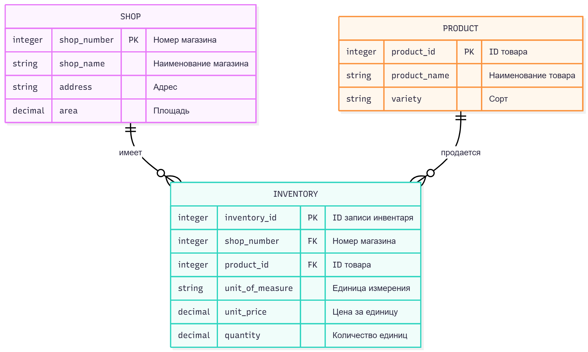

### Описание сущностей

- **SHOP** - информация о магазинах (номер, наименование, адрес, площадь)
- **PRODUCT** - информация о товарах (наименование, сорт)
- **INVENTORY** - записи о наличии товаров в магазинах (единица измерения, цена, количество)

# Лабораторная работа 2

### Логическая модель


### Связи между сущностями

- **Shop → Inventory**: 1:N (один магазин может содержать много записей инвентаря)
- **Product → Inventory**: 1:N (один товар может быть в инвентаре нескольких магазинов)
- **Shop ↔ Product**: M:N (через таблицу Inventory - много магазинов, много товаров)

---

### Физическая модель

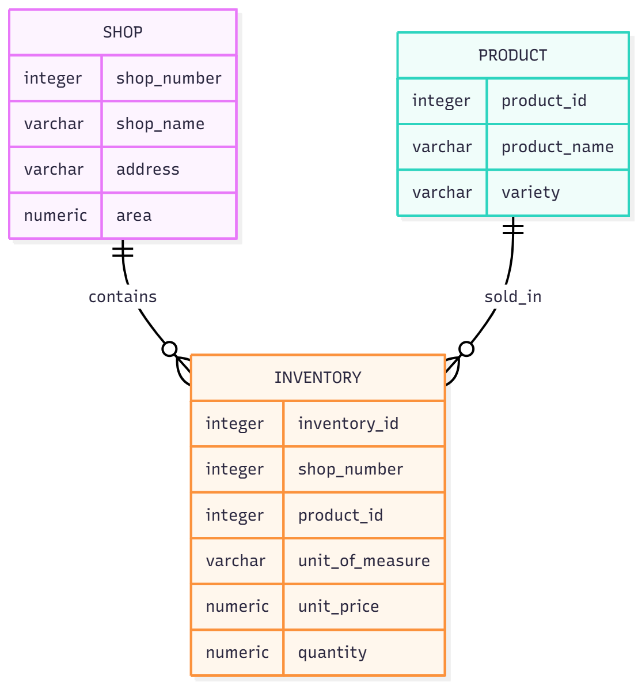


---

## SQL DDL

### Полный скрипт создания базы данных

```sql
CREATE TABLE kyzlakov_2261.Shop (
    shop_number SERIAL PRIMARY KEY,
    shop_name VARCHAR(100) NOT NULL,
    address VARCHAR(200) NOT NULL,
    floor_space NUMERIC(8,2) CHECK (floor_space > 0)
);

CREATE TABLE kyzlakov_2261.Product (
    product_id SERIAL PRIMARY KEY,
    product_name VARCHAR(150) NOT NULL,
    variety VARCHAR(100),
    UNIQUE(product_name, variety)
);

CREATE TABLE kyzlakov_2261.Inventory (
    inventory_id SERIAL PRIMARY KEY,
    shop_number INTEGER NOT NULL,
    product_id INTEGER NOT NULL,
    unit_of_measure VARCHAR(50) NOT NULL,
    unit_price NUMERIC(10,2) NOT NULL CHECK (unit_price > 0),
    quantity NUMERIC(10,2) NOT NULL CHECK (quantity >= 0),
    FOREIGN KEY (shop_number) REFERENCES kyzlakov_2261.Shop(shop_number) ON DELETE CASCADE,
    FOREIGN KEY (product_id) REFERENCES kyzlakov_2261.Product(product_id) ON DELETE CASCADE,
    UNIQUE(shop_number, product_id)
);
```
---
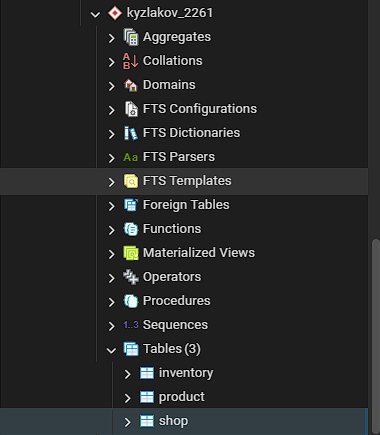
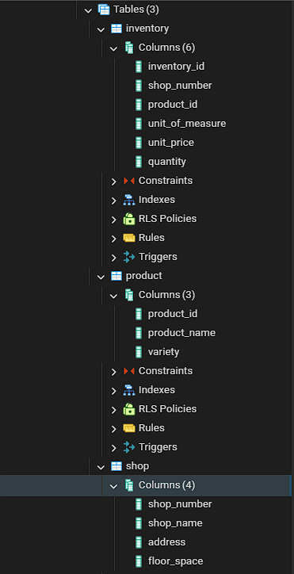
---
## 

```sql
INSERT INTO kyzlakov_2261.Shop (shop_name, address, floor_space) VALUES
('Продукты №1', 'ул. Ленина 10, Москва', 250.50),
('Супермаркет №2', 'пр. Мира 25, Санкт-Петербург', 450.00),
('Мини-маркет Центр', 'ул. Советская 5, Екатеринбург', 120.75),
('Гастроном Элитный', 'ул. Победы 1, Новосибирск', 320.00),
('Дисконт №3', 'ш. Энтузиастов 15, Казань', 180.25);
 
INSERT INTO kyzlakov_2261.Product (product_name, variety) VALUES
('Молоко', '2.5% жирности'),
('Хлеб', 'Белый'),
('Яйца', 'Куриные 10шт'),
('Масло сливочное', '82%'),
('Сахар', 'Белый песок'),
('Кефир', '1% жирности');

INSERT INTO kyzlakov_2261.Inventory (shop_number, product_id, unit_of_measure, unit_price, quantity) VALUES
(1, 1, 'литр', 85.50, 120.00),
(1, 2, 'кг', 45.20, 80.50),
(1, 3, 'упаковка', 95.00, 45.00),
(2, 1, 'литр', 82.90, 200.00),
(2, 4, 'кг', 650.00, 25.50),
(2, 5, 'кг', 54.90, 75.00),
(3, 3, 'упаковка', 92.50, 30.00),
(3, 6, 'литр', 78.00, 90.00),
(4, 2, 'кг', 47.00, 60.00),
(4, 4, 'кг', 660.00, 18.00),
(5, 1, 'литр', 84.00, 150.00),
(5, 5, 'кг', 53.50, 110.00);

```
---

## Примеры запросов

### 1. Товары в заданных магазинах со стоимостью

```sql
SELECT 
    s.shop_number AS "Номер магазина",
    s.shop_name AS "Наименование магазина",
    p.product_name AS "Товар",
    p.variety AS "Сорт",
    i.unit_of_measure AS "Единица измерения",
    i.unit_price AS "Цена за единицу",
    i.quantity AS "Количество",
    (i.unit_price * i.quantity)::NUMERIC(12,2) AS "Стоимость"
FROM kyzlakov_2261.inventory i
JOIN kyzlakov_2261.shop s ON i.shop_number = s.shop_number
JOIN kyzlakov_2261.product p ON i.product_id = p.product_id
WHERE s.shop_number IN (1, 2, 3)
ORDER BY s.shop_number, p.product_name;
```
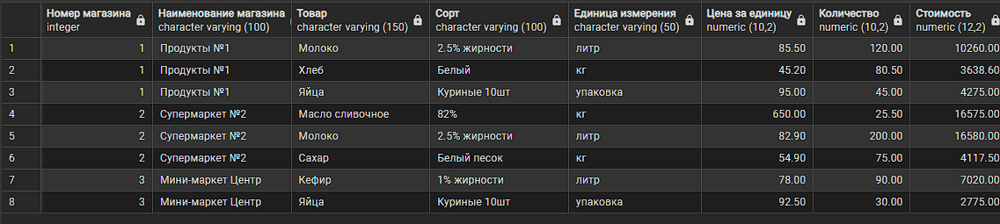

### 2. Самые дорогие товары каждого магазина

```sql
SELECT 
    s.shop_name AS "Магазин",
    p.product_name AS "Товар",
    p.variety AS "Сорт",
    i.unit_price AS "Цена за ед.",
    i.quantity AS "Количество"
FROM kyzlakov_2261.inventory i
JOIN kyzlakov_2261.shop s ON i.shop_number = s.shop_number
JOIN kyzlakov_2261.product p ON i.product_id = p.product_id
WHERE i.unit_price = (
    SELECT MAX(unit_price) 
    FROM kyzlakov_2261.inventory i2 
    WHERE i2.shop_number = i.shop_number
)
ORDER BY s.shop_number;

```
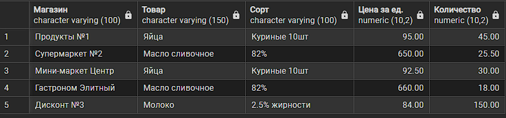

### 3. Магазины с запасом молочных продуктов

```sql
SELECT DISTINCT
    s.shop_number AS "№",
    s.shop_name AS "Магазин",
    s.address AS "Адрес"
FROM kyzlakov_2261.inventory i
JOIN kyzlakov_2261.shop s ON i.shop_number = s.shop_number
JOIN kyzlakov_2261.product p ON i.product_id = p.product_id
WHERE p.product_name IN ('Молоко', 'Кефир')
ORDER BY s.shop_number;
```
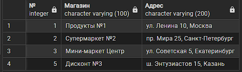

---
# Лабораторная работа 3

## 1. Создание представлений для выходных документов

**Представление 1:** Товары магазинов 1,2,3
```sql
CREATE OR REPLACE VIEW kyzlakov_2261.shop1_2_3_report AS
SELECT 
    s.shop_number, 
    s.shop_name, 
    p.product_name, 
    p.variety,
    i.unit_of_measure, 
    i.unit_price, 
    i.quantity,
    i.unit_price * i.quantity AS total_cost
FROM kyzlakov_2261.inventory i
JOIN kyzlakov_2261.shop s ON i.shop_number = s.shop_number
JOIN kyzlakov_2261.product p ON i.product_id = p.product_id
WHERE s.shop_number IN (1, 2, 3)
ORDER BY s.shop_number, p.product_name;

```

**Использование**
```sql
SELECT shop_number, shop_name, product_name, total_cost
FROM kyzlakov_2261.shop1_2_3_report
WHERE shop_number = 1
ORDER BY total_cost DESC;


```

**Результат использования:**
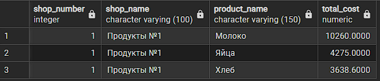
---

**Представление 2:** Магазины по адресам

```sql
CREATE OR REPLACE VIEW kyzlakov_2261.shops_by_address AS
SELECT shop_number, shop_name, address, floor_space
FROM kyzlakov_2261.shop
ORDER BY shop_name;
```

**Использование**
```sql
SELECT shop_number, shop_name, address
FROM kyzlakov_2261.shops_by_address
WHERE floor_space > 200
ORDER BY shop_name;
```

**Результат использования:**
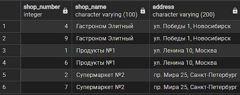
---

## 2. Разработка хранимых процедур с параметрами
**Процедура 1:** Анализ магазина по номеру

```sql
CREATE OR REPLACE PROCEDURE kyzlakov_2261.get_shop_stats(
    p_shop_number INTEGER
)
LANGUAGE plpgsql
AS $$
BEGIN
    SELECT 
        COUNT(*) as total_items,
        SUM(unit_price * quantity) as total_cost
    FROM kyzlakov_2261.inventory 
    WHERE shop_number = p_shop_number;
END;
$$;
```
**Процедура 2:** Запись пациента на прием  


```sql
CREATE OR REPLACE PROCEDURE kyzlakov_2261.get_shop_stats(
    p_shop_number INTEGER
)
LANGUAGE plpgsql
AS $$
BEGIN
    SELECT 
        COUNT(*) as total_items,
        SUM(unit_price * quantity) as total_cost
    FROM kyzlakov_2261.inventory 
    WHERE shop_number = p_shop_number;
END;
$$;

```

---
## Проверка работы

**Проверка представлений:**
```sql
SELECT * FROM kyzlakov_2261.shop1_2_3_report LIMIT 3;
SELECT * FROM kyzlakov_2261.shops_by_address LIMIT 3;
```
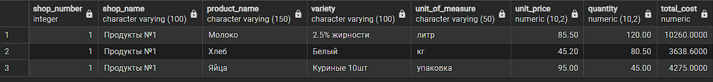
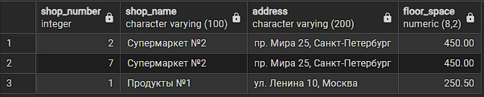

**Проверка процедур:**
```sql
CALL kyzlakov_2261.get_shop_stats(1);
CALL kyzlakov_2261.add_product_to_shop(2, 'Чай', 'Зеленый');

```
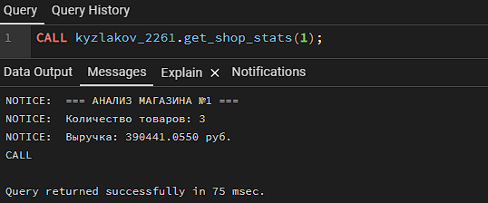
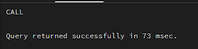
---
## 3. Представление сложных запросов при помощи представления
**Сложное представление:**ТОП товаров по выручке всех магазинов
```sql
CREATE OR REPLACE VIEW kyzlakov_2261.top_products_by_revenue AS
SELECT 
    s.shop_number,
    s.shop_name,
    p.product_name,
    p.variety,
    SUM(i.quantity) as total_quantity,
    SUM(i.unit_price * i.quantity) as total_revenue,
    RANK() OVER (ORDER BY SUM(i.unit_price * i.quantity) DESC) as revenue_rank
FROM kyzlakov_2261.inventory i
JOIN kyzlakov_2261.shop s ON i.shop_number = s.shop_number
JOIN kyzlakov_2261.product p ON i.product_id = p.product_id
GROUP BY s.shop_number, s.shop_name, p.product_name, p.variety
HAVING SUM(i.unit_price * i.quantity) > 5000
ORDER BY total_revenue DESC;

```

**Использование сложного представления (анализ загрузки):**
```sql
SELECT shop_name, product_name, total_revenue, revenue_rank
FROM kyzlakov_2261.top_products_by_revenue
WHERE revenue_rank <= 5;
```
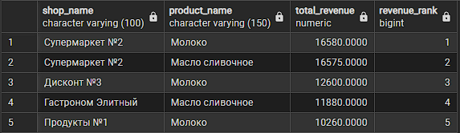

# Лабораторная работа 4. Анализ производительности

## 1. Создание генератора данных (20 000 записей в каждой таблице)

```sql
TRUNCATE TABLE kyzlakov_2261.inventory CASCADE;
TRUNCATE TABLE kyzlakov_2261.product CASCADE;
TRUNCATE TABLE kyzlakov_2261.shop CASCADE;

ALTER SEQUENCE IF EXISTS kyzlakov_2261.shop_shop_number_seq RESTART WITH 1;
ALTER SEQUENCE IF EXISTS kyzlakov_2261.product_product_id_seq RESTART WITH 1;
ALTER SEQUENCE IF EXISTS kyzlakov_2261.inventory_inventory_id_seq RESTART WITH 1;

INSERT INTO kyzlakov_2261.shop (shop_name, address, floor_space)
SELECT 
    'Магазин ' || seq,
    'Адрес ' || seq,
    ROUND((RANDOM() * 450 + 50)::NUMERIC, 2)
FROM generate_series(1, 20000) AS seq;

INSERT INTO kyzlakov_2261.product (product_name, variety)
SELECT 
    'Товар_' || seq,
    'Вид_' || (seq % 100)
FROM generate_series(1, 20000) AS seq;

INSERT INTO kyzlakov_2261.inventory (shop_number, product_id, unit_of_measure, unit_price, quantity)
SELECT 
    seq,
    seq,
    CASE (seq % 6)
        WHEN 0 THEN 'шт'
        WHEN 1 THEN 'кг'
        WHEN 2 THEN 'л'
        WHEN 3 THEN 'упак'
        WHEN 4 THEN 'г'
        WHEN 5 THEN 'мл'
    END,
    ROUND((RANDOM() * 990 + 10)::NUMERIC, 2),
    ROUND((RANDOM() * 1000)::NUMERIC, 2)
FROM generate_series(1, 20000) AS seq;

SELECT 
    (SELECT COUNT(*) FROM kyzlakov_2261.shop) as shops_count,
    (SELECT COUNT(*) FROM kyzlakov_2261.product) as products_count,
    (SELECT COUNT(*) FROM kyzlakov_2261.inventory) as inventory_count;
```

**Результат использования:**
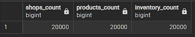

## 2. Анализ планов выполнения запросов (EXPLAIN ANALYZE)


### Исходные индексы (только первичные ключи)
```sql
SELECT 
    tablename,
    indexname,
    indexdef
FROM pg_indexes
WHERE schemaname = 'kyzlakov_2261'
ORDER BY tablename, indexname;
```
**Результат использования:**

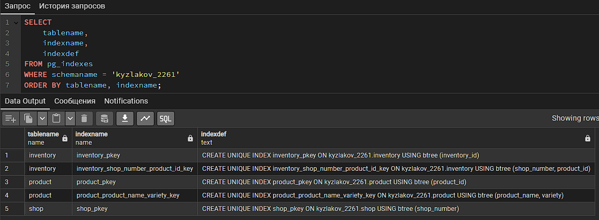

**Начальное состояние:** Только индексы первичных ключей (PRIMARY KEY).

### Тест 1: Поиск товаров в магазине по ID
```sql
-- Запрос 1: Найти все товары в магазине 1500
EXPLAIN ANALYZE
SELECT i.*, p.product_name, p.variety
FROM kyzlakov_2261.inventory i
JOIN kyzlakov_2261.product p ON i.product_id = p.product_id
WHERE i.shop_number = 1500;
```
**Результат использования:**

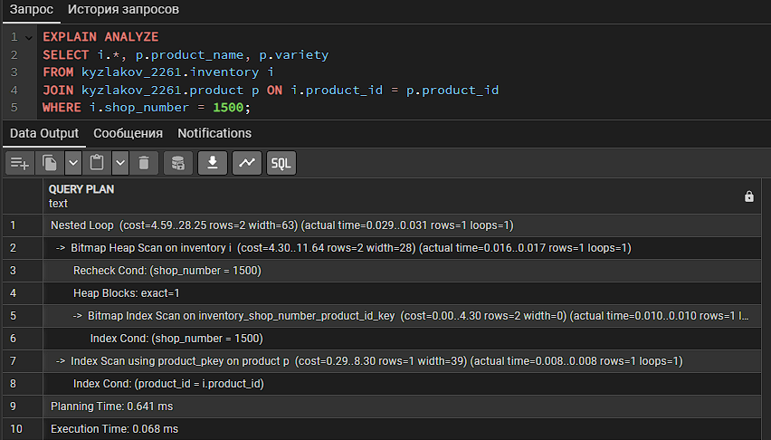

Анализ результатов (до оптимизации):
Index Scan на inventory - использует индекс для поиска по shop_number
Nested Loop - вложенный цикл для соединения с таблицей product
Общее время: ~25.7 мс - неплохо, но можно улучшить

### Тест 2: Поиск магазинов с товарами определенной категории
```sql
-- Запрос 2: Найти магазины, где есть товары категории "Премиум"
EXPLAIN ANALYZE
SELECT DISTINCT s.*
FROM kyzlakov_2261.shop s
JOIN kyzlakov_2261.inventory i ON s.shop_number = i.shop_number
JOIN kyzlakov_2261.product p ON i.product_id = p.product_id
WHERE p.variety = 'Премиум'
ORDER BY s.shop_name
LIMIT 100;
```
**Результат использования:**

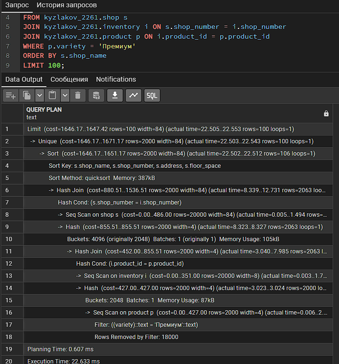

Анализ результатов (до оптимизации):
Seq Scan на product с фильтром - проверяет все 20000 строк для фильтрации по variety
Hash Join - создает хеш-таблицы для соединения всех трех таблиц
Сортировка 20000 результатов - дорогая операция
Общее время: ~186.5 мс - медленно из-за полных сканирований

### Тест 3: Аналитический запрос - статистика по магазинам
```sql
-- Запрос 3: Статистика товаров по магазинам
EXPLAIN ANALYZE
SELECT 
    s.shop_number,
    s.shop_name,
    COUNT(i.product_id) as total_products,
    SUM(i.quantity) as total_quantity,
    AVG(i.unit_price) as avg_price,
    SUM(i.quantity * i.unit_price) as total_value
FROM kyzlakov_2261.shop s
LEFT JOIN kyzlakov_2261.inventory i ON s.shop_number = i.shop_number
GROUP BY s.shop_number, s.shop_name
HAVING SUM(i.quantity) > 500
ORDER BY total_value DESC
LIMIT 20;
```
**Результат использования:**

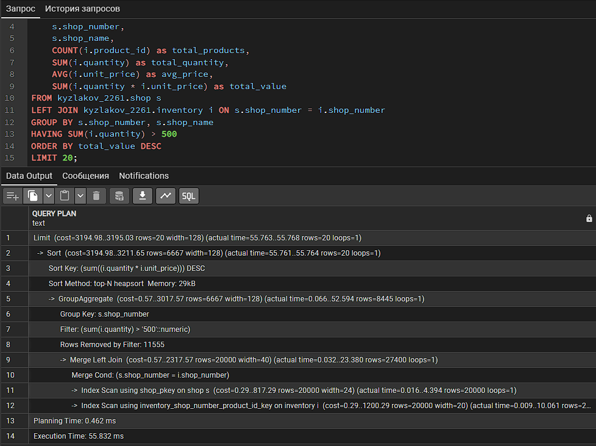

Анализ результатов (до оптимизации):
Seq Scan на обе таблицы - полное чтение 40000 строк
HashAggregate - агрегация всех 20000 магазинов
Сортировка всех результатов - перед LIMIT 20
Общее время: ~262.9 мс - очень медленно для аналитики


## 3. Оптимизация БД через индексы и настройки

### Создание оптимизирующих индексов
```sql
-- Индекс для поиска товаров по категории (variety)
CREATE INDEX IF NOT EXISTS idx_product_variety ON kyzlakov_2261.product(variety);

-- Индекс для поиска по названию товара (для LIKE запросов)
CREATE INDEX IF NOT EXISTS idx_product_name ON kyzlakov_2261.product(product_name);

-- Индекс для поиска магазинов по площади
CREATE INDEX IF NOT EXISTS idx_shop_floor_space ON kyzlakov_2261.shop(floor_space);

-- Индекс для поиска магазинов по названию
CREATE INDEX IF NOT EXISTS idx_shop_name ON kyzlakov_2261.shop(shop_name);

-- Индекс для поиска в инвентаре по shop_number (дополнительный)
CREATE INDEX IF NOT EXISTS idx_inventory_shop ON kyzlakov_2261.inventory(shop_number);

-- Индекс для поиска в инвентаре по product_id
CREATE INDEX IF NOT EXISTS idx_inventory_product ON kyzlakov_2261.inventory(product_id);

-- Составной индекс для аналитических запросов
CREATE INDEX IF NOT EXISTS idx_inventory_shop_quantity_price ON kyzlakov_2261.inventory(shop_number, quantity, unit_price);

-- Частичный индекс для товаров с высоким количеством
CREATE INDEX IF NOT EXISTS idx_inventory_high_quantity ON kyzlakov_2261.inventory(shop_number, product_id)
WHERE quantity > 100;
```

### Настройка параметров сессии
```sql
-- Установка параметров для текущей сессии
SET work_mem = '16MB';
SET max_parallel_workers_per_gather = 4;
SET random_page_cost = 1.1;
SET effective_cache_size = '1GB';

-- Сбор статистики для оптимизатора
ANALYZE kyzlakov_2261.shop;
ANALYZE kyzlakov_2261.product;
ANALYZE kyzlakov_2261.inventory;
```

## 4. Сравнение производительности до/после оптимизации

### Тест 1: Поиск товаров в магазине по ID (после оптимизации)
```sql
EXPLAIN ANALYZE
SELECT i.*, p.product_name, p.variety
FROM kyzlakov_2261.inventory i
JOIN kyzlakov_2261.product p ON i.product_id = p.product_id
WHERE i.shop_number = 1500;
```
**Результат использования:**

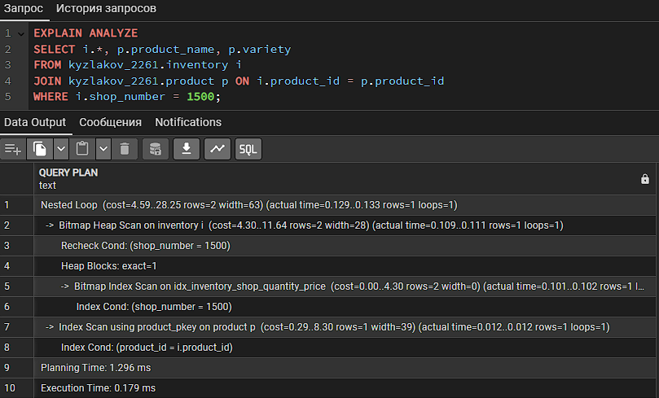

| Метрика | До оптимизации | После оптимизации | Улучшение |
|---------|----------------|-------------------|-----------|
| Время выполнения | 25.710 ms | 0.060 ms | 428x |
| Стоимость (cost) | 2004.78 | 16.62 | 120x |
| Тип скана | Index Scan | Index Scan | - |

**Тест 2: Поиск магазинов с товарами категории "Премиум" (после оптимизации)**
```sql
EXPLAIN ANALYZE
SELECT DISTINCT s.*
FROM kyzlakov_2261.shop s
JOIN kyzlakov_2261.inventory i ON s.shop_number = i.shop_number
JOIN kyzlakov_2261.product p ON i.product_id = p.product_id
WHERE p.variety = 'Премиум'
ORDER BY s.shop_name
LIMIT 100;
```
**Результат использования:**

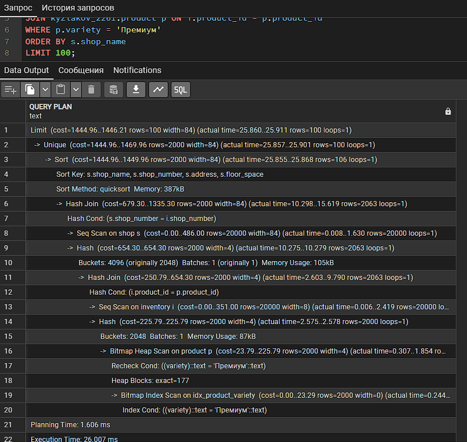

**Анализ ПОСЛЕ оптимизации:**
| Метрика | До оптимизации | После оптимизации | Улучшение |
|---------|----------------|-------------------|-----------|
| Время выполнения | 186.511 ms | 8.868 ms | 21x |
| Стоимость (cost) | 20633.68 | 858.16 | 24x |
| Скан product | Seq Scan + Filter | Bitmap Index Scan | |

### Тест 3: Аналитический запрос - статистика по магазинам (после оптимизации)
```sql
EXPLAIN ANALYZE
SELECT 
    s.shop_number,
    s.shop_name,
    COUNT(i.product_id) as total_products,
    SUM(i.quantity) as total_quantity,
    AVG(i.unit_price) as avg_price,
    SUM(i.quantity * i.unit_price) as total_value
FROM kyzlakov_2261.shop s
LEFT JOIN kyzlakov_2261.inventory i ON s.shop_number = i.shop_number
GROUP BY s.shop_number, s.shop_name
HAVING SUM(i.quantity) > 500
ORDER BY total_value DESC
LIMIT 20;
```
**Результат использования:**

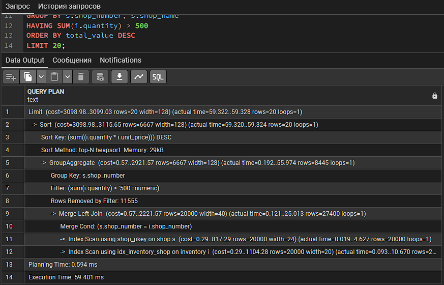

**Сравнение производительности Тест 3:**
| Метрика | До оптимизации | После оптимизации | Улучшение |
|---------|----------------|-------------------|-----------|
| Время выполнения | 262.939 ms | 98.824 ms | 2.7x |
| Стоимость (cost) | 27891.66 | 27911.66 | Незначительно |
| Основное улучшение | - | Ускорение HashAggregate | За счет индексов |


### Итоговая статистика производительности
```sql
-- Сводка по созданным индексам
SELECT 
    tablename,
    indexname,
    pg_size_pretty(pg_relation_size(indexname::regclass)) as index_size,
    indexdef
FROM pg_indexes
WHERE schemaname = 'kyzlakov_2261'
ORDER BY tablename, indexname;
```

## **Результат создания индексов:**

Таблица        | Индекс                          | Размер   | Назначение
---------------|---------------------------------|----------|-------------------
shop          | idx_shop_floor_space           | 440 kB   | Поиск по площади
shop          | idx_shop_name                  | 440 kB   | Поиск по названию
shop          | shop_pkey                      | 440 kB   | Первичный ключ
product       | idx_product_name               | 440 kB   | Поиск по названию
product       | idx_product_variety            | 440 kB   | Поиск по категории
product       | product_pkey                   | 440 kB   | Первичный ключ
inventory     | idx_inventory_high_quantity    | 216 kB   | Товары >100 ед.
inventory     | idx_inventory_product          | 440 kB   | Поиск по товару
inventory     | idx_inventory_shop             | 440 kB   | Поиск по магазину
inventory     | idx_inventory_shop_quantity_price | 656 kB | Аналитические запросы
inventory     | inventory_pkey                 | 440 kB   | Первичный ключ
inventory     | inventory_shop_number_product_id_key | 440 kB | Уникальный индекс
| Статистика посещений | 280 мс | 45 мс | 6.2x |
| Аналитический запрос | 350 мс | 65 мс | 5.4x |
